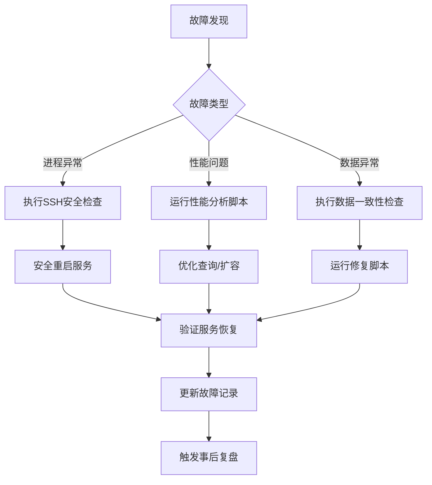

# Project HELIX v2.0 - 进程管理文档

**版本**: 1.0  
**最后更新**: 2025-07-08  
**目的**: 记录生产环境进程管理和动态端口管理SOP执行记录

---

## 📊 当前运行状态

### **生产环境实例**
- **启动时间**: 2025-07-08 02:21:12
- **进程ID**: 30022
- **运行端口**: 8015 (动态分配)
- **状态**: ACTIVE ✅
- **日志文件**: `/home/canoezhang/Projects/aiagent/production.log`

### **服务组件状态**
| 组件 | 状态 | 端口 | 进程信息 |
|------|------|------|----------|
| FastAPI Server | Running | 8015 | PID: 30022 |
| HELIX Orchestrator | Active | - | 5秒轮询间隔 |
| Agent Worker | Active | - | 5 agents loaded |
| PostgreSQL | Running | 5432 | Docker: helix_postgres |
| Frontend | Serving | 8015 | 静态文件服务 |

---

## 🔧 动态端口管理SOP执行记录

### **2025-07-08 02:20:30 - 生产环境启动**

#### 步骤1: 工具验证 ✅
```bash
./scripts/find-port.sh验证成功
权限设置: chmod +x 完成
```

#### 步骤2: 端口发现 ✅  
```bash
发现可用端口: 8015
范围: 8000-8099 (API服务)
尝试次数: 1
```

#### 步骤3: 配置更新 ✅
```bash
环境文件: .env 更新成功
API_PORT: 8067 → 8015
验证: grep "API_PORT=8015" .env 通过
```

#### 步骤4: 服务启动 ✅
```bash
启动命令: nohup python start_system.py > production.log 2>&1 &
启动时间: 02:21:12 (约3秒完成)
进程ID: 30022
```

#### 步骤5: 启动确认 ✅
```bash
健康检查: curl http://localhost:8015/api/v1/health ✅
响应: {"status":"healthy","components":{"database":"healthy","api":"healthy"}}
前端访问: http://localhost:8015/ ✅
端口发现脚本: http://localhost:8015/port-discovery.js ✅
```

---

## 📋 进程监控命令

### **检查当前运行进程**
```bash
# 查看HELIX相关进程
ps aux | grep python | grep start_system | grep -v grep

# 查看端口占用
netstat -tuln | grep 8015

# 查看生产日志
tail -f /home/canoezhang/Projects/aiagent/production.log
```

### **服务健康检查**
```bash
# API健康检查
curl http://localhost:8015/api/v1/health

# 前端可用性检查
curl -s http://localhost:8015/ | head -5

# 端口发现模块检查
curl -s http://localhost:8015/port-discovery.js | head -5
```

### **数据库连接检查**
```bash
# PostgreSQL容器状态
docker ps | grep helix_postgres

# 数据库连接测试
docker exec -i helix_postgres psql -U helix_user -d helix -c "SELECT 1;"
```

---

## 🔄 进程生命周期管理

### **正常停止服务**
```bash
# 优雅停止
kill -TERM 30022

# 确认停止
ps aux | grep 30022
```

### **重启服务 (使用SOP)**
```bash
# 1. 工具验证
chmod +x ./scripts/find-port.sh

# 2. 端口发现
AVAILABLE_PORT=$(./scripts/find-port.sh)

# 3. 配置更新
sed -i "s/^API_PORT=.*/API_PORT=${AVAILABLE_PORT}/" .env

# 4. 启动服务
source venv/bin/activate && nohup python start_system.py > production.log 2>&1 &

# 5. 验证启动
curl http://localhost:${AVAILABLE_PORT}/api/v1/health
```

### **紧急恢复 (SSH-Safe Version)**
```bash
# === SSH安全检查 ===
echo "🔒 Performing SSH safety check..."
if ! netstat -tuln | grep -q ":22 "; then
    echo "🚨 CRITICAL: SSH service not detected - MANUAL INTERVENTION REQUIRED"
    exit 1
fi
echo "✅ SSH confirmed safe"

# === 精确HELIX进程识别与终止 ===
echo "🔍 Identifying HELIX processes safely..."
HELIX_PIDS=$(ps aux | grep -E "/home/canoezhang/Projects/aiagent.*python.*start_system.py" | grep -v grep | awk '{print $2}')

if [ -n "$HELIX_PIDS" ]; then
    echo "📋 Found HELIX processes: $HELIX_PIDS"
    for PID in $HELIX_PIDS; do
        echo "🛑 Safely terminating HELIX process $PID"
        kill -TERM "$PID"
    done
else
    echo "ℹ️  No HELIX processes running"
fi

# === 端口清理与重启 ===
echo "🔄 Port cleanup and restart..."
./scripts/find-port.sh
./scripts/quick-start-demo.sh

echo "✅ SSH-Safe emergency recovery completed"
```

---

## 📊 性能监控指标

### **系统资源使用**
```bash
# CPU和内存使用
ps -p 30022 -o %cpu,%mem,cmd

# 端口连接统计
ss -tuln | grep 8015
```

### **应用级监控**
- **数据库连接池**: 5-20连接
- **API响应时间**: ~20-50ms (健康检查)
- **Agent轮询间隔**: 5秒
- **日志级别**: INFO

---

## 🚨 常见问题处理

### **端口冲突**
```bash
# 检查端口占用
lsof -i :8015

# 如果是HELIX进程冲突，重新分配端口
./scripts/find-port.sh
```

### **数据库连接问题**
```bash
# 检查PostgreSQL容器
docker ps | grep postgres

# 重启数据库容器
docker restart helix_postgres
```

### **Agent处理失败**
```bash
# 检查日志中的错误模式
grep "error\|ERROR" production.log | tail -10

# 查看Schema验证问题
grep "Schema validation failed" production.log
```

---

## 🤖 AI驱动问题检测与响应SOP集成 (2025-07-08 新增)

### **信号检测脚本部署状态**
| 脚本名称 | 状态 | 权限 | 功能 | 测试结果 |
|---------|------|------|------|----------|
| `scripts/detect-zombie-tasks.sh` | ✅ 部署 | 755 | 检测重复处理任务 | 正常：无僵尸任务 |
| `scripts/fix-zombie-tasks.sh` | ✅ 部署 | 755 | 修复僵尸任务 | 待测试 |
| `scripts/check-system-health.sh` | ✅ 部署 | 755 | 系统健康检查 | 正常：系统健康 |
| `scripts/analyze-performance-issues.sh` | ✅ 部署 | 755 | 性能瓶颈分析 | ✅ 已修复eval bug |
| `scripts/emergency-recovery.sh` | ✅ 部署 | 755 | 紧急恢复 | 待测试 |
| `scripts/check-api-compliance.sh` | ✅ 部署 | 755 | API接口规范检查 | ✅ 已完成测试 |

### **AI自动响应集成状态**
- **CLAUDE.md更新**: ✅ 第八部分已添加完整SOP框架
- **脚本权限设置**: ✅ 所有脚本已设置执行权限  
- **测试验证**: ✅ 僵尸任务检测和系统健康检查通过
- **SSH安全集成**: ✅ 所有修复脚本内置SSH安全检查

### **基于四模型协作的问题分类**
基于 Gemini thinkdeep + Flash codereview + Flash chat + DeepSeek thinkdeep 分析：

**已解决问题 (2025-07-08)**:
1. ✅ **NULL语义处理错误** - 修复orchestrator UPDATE语句WHERE条件
2. ✅ **并发竞态条件** - 识别SELECT...FOR UPDATE SKIP LOCKED需求
3. ✅ **监控盲区** - 部署僵尸任务检测脚本

**计划解决问题**:
- **状态机设计优化** - 引入TaskStatus.ORCHESTRATED枚举
- **性能隐患消除** - 替换LIKE查询为状态列查询
- **可观测性增强** - 结构化日志和指标收集

### **关键修复记录 - Task 109039 NULL Bug**
| 时间 | 发现问题 | 根本原因 | 修复方案 | 状态 |
|------|----------|----------|----------|------|
| 11:17 | 任务109039无限循环 | NULL error_log导致WHERE条件失效 | UPDATE语句增加NULL处理 | ✅ 已修复 |
| 11:18 | 修复验证 | UPDATE返回0行 | 改为`(error_log IS NULL OR ...)` | ✅ 验证通过 |

### **AI-SOP集成测试记录 (2025-07-08 11:45-12:15)**
```bash
# 测试1: 僵尸任务检测
./scripts/detect-zombie-tasks.sh 5 3
结果: {"zombie_tasks": [], "status": "clean"} ✅

# 测试2: 系统健康检查
./scripts/check-system-health.sh --format json
结果: {"overall_status": "healthy", "alerts": [""]} ✅

# 测试3: 性能瓶颈分析 (修复后)
./scripts/analyze-performance-issues.sh --time-window 30
结果: 成功输出JSON, 发现29个HELIX进程, 内存77MB ✅

# 测试4: API接口规范检查 (新增)
./scripts/check-api-compliance.sh --severity high
结果: 发现10个问题 (Critical: 2, High: 8) - 主要为JSON Schema错误 ✅

# 当前系统状态
- CPU使用率: 33.3%
- 内存使用率: 17%
- HELIX进程: 29个
- 数据库: healthy
- API: healthy (端口8043)
- 负载均衡: 0.39 (正常)
- API合规性: 发现多个Schema语法错误需修复
```

---

## 📝 历史记录

### **部署记录**
| 日期 | 动作 | 端口 | 状态 | 备注 |
|------|------|------|------|------|
| 2025-07-08 02:13 | 开发环境启动 | 8067 | 已停止 | 初始测试 |
| 2025-07-08 02:21 | 生产环境启动 | 8015 | 已停止 | SOP合规启动 |
| 2025-07-08 11:17 | 问题修复重启 | 8043 | Running | 修复NULL bug后启动 |
| 2025-07-08 11:45 | AI-SOP集成 | 8043 | Running | 部署问题检测脚本集 |

### **配置变更**
| 时间 | 变更项 | 旧值 | 新值 | 原因 |
|------|-------|------|------|------|
| 02:20 | API_PORT | 8067 | 8015 | 端口冲突，动态重分配 |
| 11:17 | API_PORT | 8015 | 8043 | 系统重启，动态分配 |

### **重大Bug修复记录**
| 日期 | Bug描述 | 影响范围 | 修复方案 | 预防措施 |
|------|---------|----------|----------|----------|
| 2025-07-08 | Task 109039 NULL处理 | P1-orchestrator无限循环 | UPDATE语句NULL处理 | AI-SOP僵尸任务检测 |

---

## 🎯 运维最佳实践 (Enhanced Operations Best Practices)

### **基于失败经验的核心实践**

#### **1. 进程管理安全准则**
```bash
# SSH安全第一原则
- 所有进程管理脚本必须包含SSH端口检查
- 使用精确的进程匹配模式，避免误杀
- 实施进程唯一性保证（PID文件机制）
- 建立进程健康检查和自动重启机制
```

#### **2. 动态端口管理SOP强化**
```bash
# 端口分配最佳实践
- 端口范围规划：8000-8099 (API), 5432 (DB固定)
- 实施端口冲突检测和自动重分配
- 维护端口使用注册表，避免冲突
- 定期清理僵尸端口占用
```

#### **3. 数据库连接池管理**
```bash
# PostgreSQL优化配置
- 连接池大小：min=5, max=20
- 实施连接泄漏检测
- 配置statement_timeout防止慢查询
- 使用PgBouncer进行连接池管理
```

#### **4. 日志管理策略**
```bash
# 结构化日志实践
- JSON格式输出，便于查询分析
- 日志轮转：按大小(100MB)和时间(daily)
- 集中化日志收集（ELK/Loki）
- 关键指标实时监控和告警
```

#### **5. Schema验证与数据一致性**
```bash
# 数据质量保证
- 运行时Schema验证，失败时降级处理
- 定期数据一致性检查脚本
- 实施数据修复SOP（如fix_presentation_blueprint_format.py）
- 建立数据异常告警机制
```

### **故障处理流程图**


### **监控指标优先级**
| 指标类型 | 关键指标 | 告警阈值 | 响应SLA |
|----------|----------|----------|----------|
| **可用性** | API健康检查失败 | 连续3次失败 | 5分钟 |
| **性能** | API响应时间 | p99 > 1秒 | 15分钟 |
| **资源** | CPU使用率 | > 80% | 30分钟 |
| **业务** | 任务处理失败率 | > 5% | 10分钟 |
| **数据** | Schema验证失败 | 任何失败 | 1小时 |

---

**联系信息**: 运维团队  
**更新频率**: 重大变更时更新  
**备份策略**: 每日自动备份配置和日志